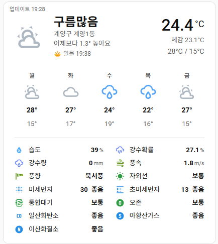

# Naver Weather Card

Home Assistant용 네이버 날씨 커스텀 카드입니다.  
[Naver Weather](https://github.com/af950833/naver_weather) 통합에서 생성한 날씨/예보/대기질 센서를 한 카드에 보기 좋게 표시합니다.


## 미리보기



## 주요 기능

- Home Assistant 기본 날씨 카드와 비슷한 간결한 레이아웃
- 현재 날씨, 현재 온도, 체감 온도, 최고/최저 온도 표시
- 현재 시간 기준 다음 일출/일몰 표시
- 1-7일 주간 예보 표시
- 습도, 강수 확률, 강수량, 풍속, 풍향, 자외선 정보 표시
- 미세먼지, 초미세먼지, 통합대기, 오존 등 대기질 정보 표시
- 날씨 상태에 따른 동적 아이콘
- 대기질 등급에 따른 동적 색상
- 각 항목 터치 시 해당 센서의 more-info 표시
- Home Assistant 비주얼 에디터 지원

## 요구 사항

이 카드는 [Naver Weather](https://github.com/af950833/naver_weather) 통합에서 생성한 엔티티를 기준으로 동작합니다.

필수:

- `weather.naver_weather_*`
- 같은 prefix를 가진 `sensor.naver_weather_*` 센서들

예:

```text
weather.naver_weather_gyeyang1
sensor.naver_weather_gyeyang1_temperature
sensor.naver_weather_gyeyang1_feels_like_temperature
sensor.naver_weather_gyeyang1_fine_dust
sensor.naver_weather_gyeyang1_sun_times
```

## 설치

### HACS

1. Home Assistant에서 HACS를 엽니다.
2. `Dashboard` 또는 `Frontend` 메뉴로 이동합니다.
3. 오른쪽 위 메뉴에서 `사용자 정의 저장소`를 선택합니다.
4. 저장소 주소를 입력합니다.

```text
https://github.com/af950833/naver-weather-card
```

5. 카테고리는 `Dashboard`를 선택합니다.
6. `Naver Weather Card`를 설치합니다.
7. Home Assistant 대시보드 리소스에 아래 경로가 추가되었는지 확인합니다.

```text
/hacsfiles/naver-weather-card/naver-weather-card.js
```

리소스 타입은 `JavaScript Module` 또는 `module`입니다.

### 수동 설치

1. `dist/naver-weather-card.js` 파일을 Home Assistant의 `www` 아래에 복사합니다.

```text
<config>/www/custom-lovelace/naver-weather-card/naver-weather-card.js
```

2. 대시보드 리소스에 아래 경로를 추가합니다.

```text
/local/custom-lovelace/naver-weather-card/naver-weather-card.js
```

리소스 타입은 `JavaScript Module` 또는 `module`입니다.

## 사용법

대시보드에서 카드를 추가하고 `Naver Weather Card`를 선택합니다.  
비주얼 에디터에서 기본 날씨 엔티티를 선택할 수 있습니다.

YAML로 직접 추가할 수도 있습니다.

```yaml
type: custom:naver-weather-card
entity: weather.naver_weather_gyeyang1
name: 계양구 계양1동
forecast_days: 5
show_details: true
show_air_quality: true
```

## 설정 옵션

| 옵션 | 필수 | 기본값 | 설명 |
| --- | --- | --- | --- |
| `type` | 예 |  | `custom:naver-weather-card` |
| `entity` | 예 |  | Naver Weather 통합의 `weather.*` 엔티티 |
| `name` | 아니오 | weather 엔티티 이름 | 카드에 표시할 위치 이름 |
| `forecast_days` | 아니오 | `5` | 표시할 예보 일수. 1-7 |
| `show_details` | 아니오 | `true` | 습도, 강수, 풍속 등 상세 날씨 정보 표시 |
| `show_air_quality` | 아니오 | `true` | 미세먼지 및 대기질 정보 표시 |

## 터치 동작

카드의 각 항목은 관련 엔티티의 more-info를 엽니다.

| 영역 | 열리는 엔티티 |
| --- | --- |
| 카드 빈 영역 | 기본 `weather.*` 엔티티 |
| 현재 온도 | 현재 온도 센서 |
| 체감 온도 | 체감 온도 센서 |
| 최고/최저 온도 | 오늘 최고/최저 온도 센서 |
| 일출/일몰 | 일출/일몰 센서 |
| 주간 예보 | 해당 주간 예보 센서 |
| 상세 날씨 정보 | 해당 날씨 센서 |
| 대기질 정보 | 해당 대기질 센서 |

## 문제 해결

### 카드가 보이지 않음

- 리소스 URL이 맞는지 확인하세요.
- HACS 설치라면 `/hacsfiles/naver-weather-card/naver-weather-card.js`를 사용하세요.
- 수동 설치라면 `/local/custom-lovelace/naver-weather-card/naver-weather-card.js`를 사용하세요.
- 브라우저 캐시를 새로고침하세요.

### 센서 값이 비어 있음

- 먼저 [Naver Weather](https://github.com/af950833/naver_weather) 통합이 정상 동작하는지 확인하세요.
- 카드의 `entity`가 올바른 `weather.naver_weather_*` 엔티티인지 확인하세요.
- 카드가 같은 prefix의 센서를 찾을 수 있어야 합니다.

## 라이선스

이 카드는 [Naver Weather](https://github.com/af950833/naver_weather) 통합과 함께 사용하기 위해 제작되었습니다.

